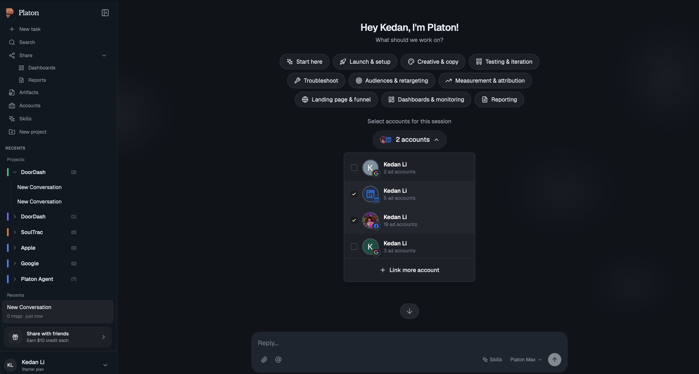
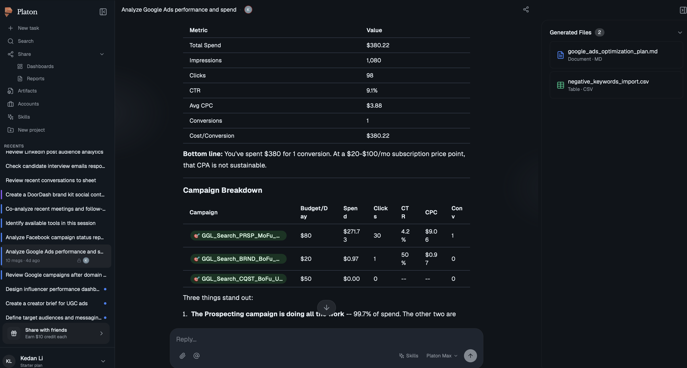
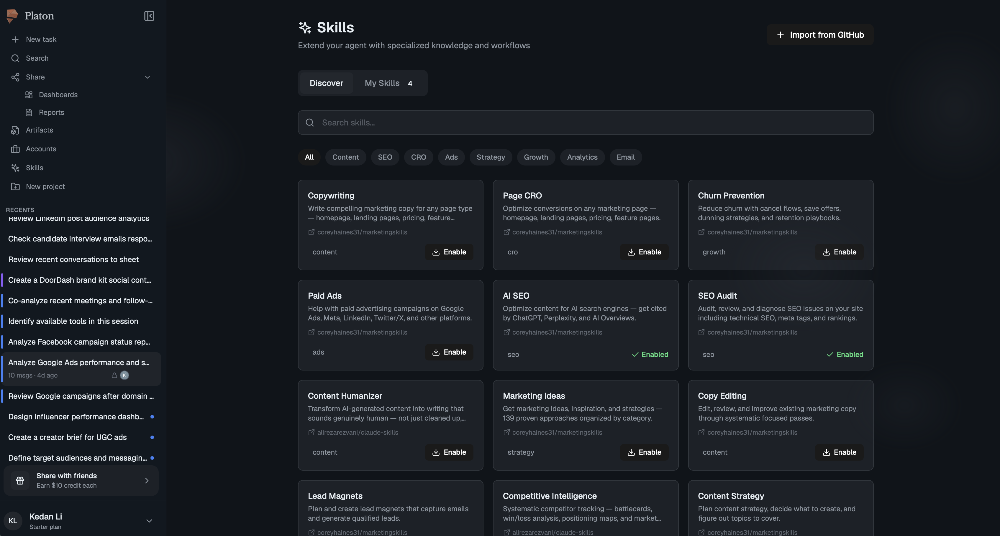
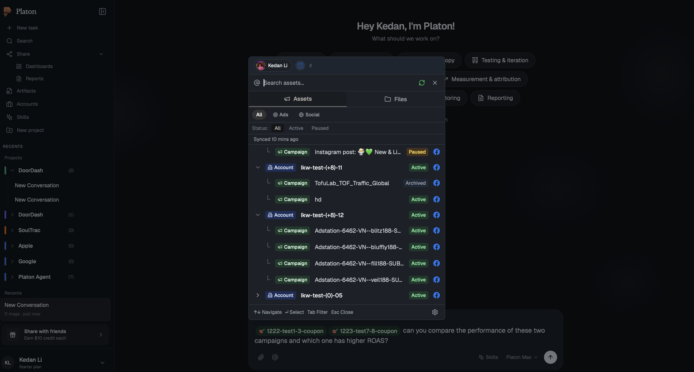

<p align="center">
  <h1 align="center">Cadens</h1>
  <p align="center">
    <strong>Self-hostable AI agent with code execution, web search, and dashboards. Shape it to your business.</strong>
    <br />
    <br />
    Extracted from production. Not a framework. Not a library. A complete, working application.
  </p>
</p>

<p align="center">
  <a href="https://www.youtube.com/watch?v=R3hAwCtI0AI">Watch Demo</a> &bull;
  <a href="https://platonagent.ai">Try the Live Product</a> &bull;
<a href="https://x.com/kedan_li">@kedan_li</a>
</p>

<p align="center">
  
  
  
  
</p>

---

### See it in action

[](https://www.youtube.com/watch?v=R3hAwCtI0AI)

**[Try the live product at platonagent.ai](https://platonagent.ai)** -- the production system Cadens was extracted from.

---

### Screenshots

<table>
  <tr>
    <td></td>
    <td></td>
  </tr>
  <tr>
    <td align="center"><strong>Home screen</strong> — quick-start topics, connected accounts, project sidebar</td>
    <td align="center"><strong>Agent at work</strong> — analyzing ad performance, campaign breakdown, generated files</td>
  </tr>
  <tr>
    <td></td>
    <td></td>
  </tr>
  <tr>
    <td align="center"><strong>Skills marketplace</strong> — install specialized capabilities from GitHub</td>
    <td align="center"><strong>Asset browser</strong> — browse and reference ad accounts, campaigns, and assets inline</td>
  </tr>
</table>

---

## Why this exists

I built an AI agent for my marketing team -- think Claude Code, but through a web UI that non-technical people can actually use. It manages ad campaigns, pulls analytics, writes reports, executes code, creates dashboards, conducts research, builds brand kits, handles SEO, GEO, visual design, content posting, social analysis, social feeds, and more. Built in 4 months. 30+ real customers. Running in production. Customers love the experience.

But I kept running into a deeper problem. Every customer wanted to ingest data differently, manage Google Ads with full structural control, run custom services for LinkedIn or X or Reddit -- different UX, different integrations, different everything. Then people started asking "can this do sales?" "customer support?" "enterprise data intelligence?" The more I customized for each one, the more I realized: they shouldn't be renting my version of this. They should be owning theirs. **The real bottleneck isn't intelligence -- it's that every business needs an AI agent shaped exactly like their business, and no SaaS product can be all shapes at once.**

I also realized something else: people don't just want to use a tool -- they want to *own* it. They want control over their IP, control over how it works. The appetite for pure SaaS is shrinking. People want to feel capable, not locked in.

The core platform is domain-agnostic. Marketing is just prompts, tools, skills, features, user experience, and integrations layered on top. **Any vertical works.**

So I'm open-sourcing a customizable version of Claude with coding agent support. Not a stripped-down version. The real thing.

```
docker compose up → full AI agent at localhost:3000
```

Customize it for your domain (prompts, tools, integrations). 10x your non-technical members, not just your builders. Host it for your team. Own your data.

> **Read the [Design Document](DESIGN.md)** for a deep dive into how the agent works under the hood.

---

## How Cadens compares

Every project in this space makes trade-offs. Here's where Cadens sits:

| | Cadens | OpenClaw | Dify | OpenHands | Cline | CrewAI | LangGraph | n8n | Paperclip |
|---|---|---|---|---|---|---|---|---|---|
| **What it is** | Full-stack agent app | Personal AI assistant | Visual agent builder | Coding agent | VS Code extension | Multi-agent framework | Workflow framework | Workflow automation | Agent orchestration |
| **Primary audience** | Customized by builder, used by anyone | Individual power users | Business users | Developers | Developers | Developers | Developers | Business ops | Technical operators |
| **Code execution sandbox** | Yes (MCP + UID isolation) | Yes | Yes (basic) | Yes (Docker) | Via terminal | No | No | No | No |
| **Interactive artifacts** | Yes (HTML, React, charts, dashboards) | No | Basic | No | No | No | No | No | No |
| **Visible thinking process** | Yes (streaming thinking + tool calls shown live) | No | No | Yes (terminal output) | Yes (inline) | No | No | No | No |
| **Reconnection resilience** | Yes (background runner + event buffer) | No | No | No | N/A | No | No | No | No |
| **Context overflow handling** | Smart compaction | Truncate | Truncate | Truncate | Truncate | None | None | N/A | Persistent state |
| **Sub-agent spawning** | Yes | No | No | No | No | Yes (roles) | Yes (graph) | No | Yes (org hierarchy) |
| **Skills system** | Yes (composable, parameterized) | No | No | No | Yes | No | No | No | No |
| **Domain customization** | Prompts + tools + skills layers | Plugins | Visual blocks | Limited | MCP config | Code only | Code only | Workflow templates | Company templates |
| **Built-in auth** | Yes (JWT + OAuth + refresh rotation) | Yes | Yes | Basic | N/A | No | No | Yes | Basic |
| **Hosted for your team** | Yes | Yes | Yes | Yes | N/A (IDE plugin) | Partial | No | Yes | Yes |
| **License** | Apache 2.0 | MIT | Apache 2.0 | MIT | Apache 2.0 | MIT | MIT | FSL (not OSI) | MIT |
| **Origin** | Extracted from production | Built as product | Built as product | Research project | IDE tool | Framework-first | Framework-first | Automation tool | Built as product |

### The gap Cadens fills

```
                    For developers only          For everyone
                    ┌─────────────────┐          ┌─────────────────┐
                    │ Claude Code     │          │ ChatGPT         │
   Can't customize  │ Cline           │          │ Claude.ai       │  Can't customize
   Can't host       │ Aider           │          │ Gemini          │  Can't host
                    │ OpenHands       │          │                 │  No real tools
                    └─────────────────┘          └─────────────────┘

                              Cadens
                    ┌─────────────────────────┐
                    │ Claude Code power        │
                    │ + Web UI for any team    │
                    │ + Hosted for your team   │
                    │ + Fully customizable     │
                    │ + Your domain, your data │
                    └─────────────────────────┘
```

---

## What your team gets

- **Code execution** -- Python & Node.js in per-session sandboxes with UID isolation
- **Web search & scraping** -- Real-time search and full page extraction
- **File management** -- Upload, download, read, write, edit with generated exports (reports, CSVs, plans)
- **Custom tools** -- Connect to any API or internal service via Python classes
- **Sub-agents** -- Spawn specialized agents for parallel work
- **Task planning** -- Agent breaks complex work into tracked task lists with live progress
- **Artifacts** -- Interactive HTML, React components, charts, dashboards
- **Skills system** -- Reusable capabilities that extend the agent with specialized knowledge
- **Platform connections** -- Connect external accounts and reference them inline in chat
- **Connector integrations** -- Slack, GitHub, Google, and more -- agent reads, writes, and acts across your tools
- **Team & group management** -- Organize users, share data, and manage access across your team
- **Smart context** -- Conversations of any length via intelligent compaction
- **Multi-provider** -- Anthropic, OpenAI, Gemini with deep per-provider features
- **BYOK** -- Bring your own LLM API keys
- **Proactive agent** -- *(coming soon)* Agent initiates tasks on schedule, not just on demand

---

## Architecture

```
┌──────────────────────────────────────────────────────────────────────────┐
│                              USERS                                      │
│                    Web Browser (any device)                              │
└───────────────────────────┬──────────────────────────────────────────────┘
                            │ HTTPS
                            ▼
┌──────────────────────────────────────────────────────────────────────────┐
│                     Frontend (Next.js 15)                     :3000     │
│                                                                         │
│  ┌─────────────┐  ┌──────────────┐  ┌───────────┐  ┌───────────────┐  │
│  │ Chat UI     │  │ Artifact     │  │ File      │  │ Settings &    │  │
│  │ Streaming   │  │ Renderer     │  │ Manager   │  │ Auth UI       │  │
│  │ Messages    │  │ (HTML/React/ │  │ Upload/   │  │               │  │
│  │ Typewriter  │  │  Charts/SVG) │  │ Download  │  │               │  │
│  └─────────────┘  └──────────────┘  └───────────┘  └───────────────┘  │
└───────────────────────────┬──────────────────────────────────────────────┘
                            │ REST + SSE
                            ▼
┌──────────────────────────────────────────────────────────────────────────┐
│                     Backend (FastAPI)                          :8000     │
│                                                                         │
│  ┌─────────────┐  ┌──────────────┐  ┌───────────┐  ┌───────────────┐  │
│  │ Auth        │  │ Session      │  │ File      │  │ Chat Proxy    │  │
│  │ JWT +       │  │ Management   │  │ Storage   │  │ to Brain      │  │
│  │ OAuth       │  │              │  │ (S3)      │  │ (SSE relay)   │  │
│  └─────────────┘  └──────────────┘  └───────────┘  └───────────────┘  │
└───────────────────────────┬──────────────────────────────────────────────┘
                            │ HTTP (internal)
                            ▼
┌──────────────────────────────────────────────────────────────────────────┐
│                     Brain (FastAPI)                            :9000     │
│                                                                         │
│  ┌─────────────┐  ┌──────────────┐  ┌───────────┐  ┌───────────────┐  │
│  │ ReAct Loop  │  │ Tool         │  │ Sub-Agent │  │ LLM Provider  │  │
│  │ Reason →    │  │ Registry &   │  │ Spawner   │  │ Manager       │  │
│  │ Act →       │  │ Executor     │  │ (Task     │  │ (Anthropic/   │  │
│  │ Observe     │  │              │  │  tool)    │  │  OpenAI/      │  │
│  │             │  │              │  │           │  │  Gemini)      │  │
│  └─────────────┘  └──────────────┘  └───────────┘  └───────────────┘  │
│                                                                         │
│  ┌─────────────┐  ┌──────────────┐  ┌───────────┐  ┌───────────────┐  │
│  │ SSE Stream  │  │ Context      │  │ Langfuse  │  │ Message       │  │
│  │ Background  │  │ Compaction   │  │ Tracing   │  │ History       │  │
│  │ Runner      │  │ Engine       │  │           │  │ Manager       │  │
│  └─────────────┘  └──────────────┘  └───────────┘  └───────────────┘  │
└──────────┬───────────────────────────────────┬───────────────────────────┘
           │ HTTP                              │ MCP (Streamable HTTP)
           ▼                                   ▼
┌────────────────────┐              ┌──────────────────────────────────────┐
│ Crawl4AI    :11235 │              │ Executor Service                :9100│
│                    │              │                                      │
│ Web search,        │              │ ┌──────────────┐  ┌──────────────┐  │
│ page scraping,     │              │ │ MCP Server   │  │ Sandbox      │  │
│ content extraction │              │ │ (FastMCP)    │  │ Manager      │  │
└────────────────────┘              │ └──────────────┘  └──────────────┘  │
                                    │ ┌──────────────┐  ┌──────────────┐  │
                                    │ │ Bash Tool    │  │ File Tools   │  │
                                    │ │ (Python,     │  │ (Read/Write/ │  │
                                    │ │  Node.js)    │  │  Edit/Glob)  │  │
                                    │ └──────────────┘  └──────────────┘  │
                                    │ ┌──────────────┐  ┌──────────────┐  │
                                    │ │ Session      │  │ UID          │  │
                                    │ │ Workspace    │  │ Isolation    │  │
                                    │ │ (/mnt/       │  │ (per-session │  │
                                    │ │  workspace/) │  │  OS users)   │  │
                                    │ └──────────────┘  └──────────────┘  │
                                    └──────────────────────────────────────┘
```

Four services. Clear boundaries. Each independently scalable. Brain ↔ Executor communicates via MCP (Model Context Protocol), so any MCP-compatible tools plug in natively.

**[Read the full Design Document →](DESIGN.md)**

---

## Customize for your domain

| Layer | How | Example |
|---|---|---|
| **Prompts** | Edit `brain/prompts/main_agent.jinja2` | "You are an expert financial analyst..." |
| **Tools** | Add Python classes to `brain/tools/built_in/` | `PortfolioAnalyzer`, `TicketResolver`, `InventoryChecker` |
| **Skills** | Add skill files | `/analyze-portfolio`, `/draft-response`, `/generate-report` |
| **Integrations** | Implement credential + tool bundle | Salesforce, Shopify, Slack, your internal APIs |
| **Data sources** | Connect existing platforms so users skip the complex UI | "Analyze my Google Ads" instead of navigating Ads Manager |
| **Connectors** | Add OAuth connectors for external platforms | Google Workspace, GitHub, HubSpot, Stripe |
| **Memory & knowledge** | Persistent knowledge the agent retains across sessions | Company docs, SOPs, product specs -- agent learns your business |
| **UI components** | Add React components to the chat | Interactive forms, data visualizations, inline editors |
| **Pages & tabs** | Add new sections to the app | Custom dashboard pages, settings tabs, admin panels |
| **Services** | Add backend microservices | Custom data pipelines, ML models, domain-specific APIs |
| **Branding** | White-label with your own identity | Your logo, colors, domain -- ship it as your own product |
| **Permissions** | Role-based access control for tools and data | Limit who can execute code, access accounts, or modify settings |
| **Team sharing** | Share sessions, data, and agent outputs across your team | Shared conversation history, collaborative research, team-wide knowledge |
| **Approval workflows** | Human-in-the-loop for high-stakes actions | Agent drafts the email but waits for sign-off before sending |
| **Webhooks & API** | Trigger external actions or use the agent programmatically | Agent finishes report → Slack notification; headless API for automation |
| **Scheduled tasks** | Run agent work on a schedule | Daily performance reports, weekly audits, overnight data processing |
| **Notifications** | Alert users when the agent needs attention or finishes work | Email, Slack, or in-app alerts for completed tasks or required approvals |
| **Audit trail** | Full log of agent actions, user requests, and data access | Compliance reporting, debugging, team accountability |
| **Artifact types** | Extend the artifact renderer | Custom chart types, domain-specific visualizations, embedded apps |
| ... | **The list goes on.** It's a full application -- customize anything. | |

Marketing is just where we started. **This is for any non-technical team.**

---

## Star to help us prioritize the release

I'm preparing the full source for public release. Honestly, a star tells me someone out there wants this -- and that makes me ship faster.

<p align="center">
  <a href="https://github.com/likedan/cadens">
    
  </a>
</p>

**What's coming:** Complete source (all 4 services), Docker Compose one-command setup, documentation, example verticals, and contributing guide.

---

## Stay in the loop

- **[Watch the demo](https://www.youtube.com/watch?v=R3hAwCtI0AI)**
- **[Try the live product](https://platonagent.ai)**
- **[@kedan_li](https://x.com/kedan_li)** -- follow for updates

## License

Apache 2.0. See [LICENSE](LICENSE).

---

<p align="center">
  <strong>Built in production. Open sourced for everyone.</strong>
</p>
